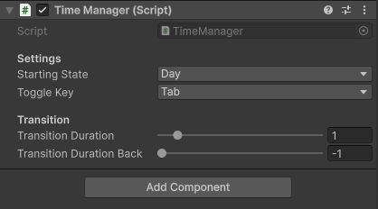

# Palette Swap for Unity 2D

This project implements a palette swapping system for Unity 2D games, allowing dynamic switching between day and night color schemes for sprites.

## Screenshots

## Requirements

- Unity 6.3 or compatible version
- Unity 2D project

## How It Works

This palette swapping system is designed for pixel-style 2D games (not yet compatible with non-pixel art). It works by replacing colors in a sprite's texture with corresponding colors from a palette texture. Each palette is a 1-pixel high texture where the width represents the number of colors (e.g., 8 colors = 8 pixels wide).

Optionally, sprites can swap to an entirely different night variant texture during the transition, allowing visual changes beyond color (e.g. a character gaining a sword at night). Both the palette change and sprite swap are driven by the same transition wipe, so detail pixels on the night sprite appear exactly as the wipe reaches their position.

### Key Components

1. **PaletteSwap.shader**: A custom shader that performs color replacement and optional sprite swapping in real-time, with multiple pixel-by-pixel wipe transition modes.
2. **TimeManager.cs**: Manages the day/night state and handles transitions with independently configurable to-night and to-day durations.
3. **TimePaletteSwap.cs**: Applies the palette swap to individual sprites, with optional sprite swap and configurable transition mode per sprite.

### Palette Format

- **Height**: Must be exactly 1 pixel
- **Width**: Can be any size (number of colors), but day and night palettes must have identical widths and color mappings
- Each pixel represents one color in the palette
- **Important**: The day palette must contain the exact colors used in the sprite texture. The night palette should have corresponding alternative colors in the same positions. Day and night palettes must match exactly in size and color positions. Mismatched palettes may produce undefined visual results.

## Setup Instructions

### 1. Import the Assets

Add the following files to your Unity project:
- `PaletteSwap.shader`
- `TimeManager.cs`
- `TimePaletteSwap.cs`

### 2. Create Palette Textures

1. Create two palette textures (PNG format recommended):
   - Day palette: Contains the exact same colors as the sprite you want to palette swap (original/daytime colors)
   - Night palette: Contains the nighttime/alternative colors corresponding to each day color
2. Ensure both palettes have:
   - Height of 1 pixel
   - Identical width (same number of colors)
   - Import settings in Unity:
     - **Texture Type**: Sprite (2D and UI)
     - **Wrap Mode**: Clamp
     - **Filter Mode**: Point (no filter)
     - **Format**: Any
     - **Compression**: None

### 3. Create the Material

1. Create a new Material in Unity
2. Set the Shader to `Custom/PaletteSwap`
3. In the Material properties:
   - **Day Sprite**: Assign the day sprite texture (ensure it has pixel-art friendly import settings: Texture Type = Sprite, Wrap Mode = Clamp, Filter Mode = Point, Compression = None)
   - **Night Sprite**: Assign the night variant sprite texture (only used when Sprite Swap is enabled)
   - **Day Palette**: Assign your day palette texture
   - **Night Palette**: Assign your night palette texture
   - **Palette Size**: Set to the width of your palettes (number of colors)
   - **Match Threshold**: Adjust sensitivity for color matching (default 0.01)
   - **Is Night**: Controlled by the script (0 = day, 1 = night)
   - **Sprite Swap**: Toggle to enable night sprite swapping (can also be controlled via the TimePaletteSwap script)

### 4. Set Up the Time Manager

1. Attach the `TimeManager` script to any GameObject in your scene (e.g., the player object)
2. Configure settings:
   - **Starting State**: Choose Day or Night
   - **Toggle Key**: Key to switch between day/night (default Tab)
   - **Transition Duration**: Seconds for the day → night transition. `0` = instant
   - **Transition Duration Back**: Seconds for the night → day transition. `0` = instant. `-1` = use Transition Duration

### 5. Apply to Sprites

1. Select a SpriteRenderer in your scene
2. Attach the `TimePaletteSwap` script to the same GameObject as the SpriteRenderer
3. Assign the Material you created to the SpriteRenderer's Material field
4. In the `TimePaletteSwap` script:
   - **Day Palette**: Assign the day palette texture (must match the one in the material)
   - **Night Palette**: Assign the night palette texture (must match the one in the material)
   - **Use Sprite Swap**: Check this if the sprite has a night variant texture
   - **Night Sprite**: Assign the night variant texture (only required when Use Sprite Swap is checked)
   - **Transition Mode**: Choose the wipe direction for this sprite (see Transition Modes below)
   - **Row Steps**: Number of discrete rows (only relevant for Row By Row mode)

   **Note**: The palettes assigned to the `TimePaletteSwap` script must exactly match those in the material (No clue what happens when they are not matching).

## Transition Modes

Each sprite can use a different transition mode independently. All modes are pixel-by-pixel hard cuts — a pixel switches the instant the wipe reaches it. **Blend** is the only mode that fades all pixels simultaneously.

| Mode | Description |
|---|---|
| Blend | All pixels fade simultaneously (smooth, not pixel-by-pixel) |
| Left To Right | Wipe sweeps from left edge to right |
| Right To Left | Wipe sweeps from right edge to left |
| Top To Bottom | Wipe sweeps from top edge to bottom |
| Bottom To Top | Wipe sweeps from bottom edge to top |
| Row By Row | Switches in discrete horizontal bands, count set by Row Steps |
| Center Horizontal | Wipe expands outward from the vertical center line |
| Center Vertical | Wipe expands outward from the horizontal center line |
| Center Outward | Wipe expands outward from the center point in all directions |

## Usage

- Press the configured toggle key (default Tab) to switch between day and night
- If **Transition Duration** is `0`, the swap is instant with no wipe
- If **Transition Duration** is greater than `0` (up to 10 seconds), the transition wipe plays over that duration
- Day → night and night → day can have different durations via **Transition Duration Back**. Set to `-1` to mirror the forward duration
- Sprites without a night variant work as palette-only swaps — leave **Use Sprite Swap** unchecked
- Sprites with **Use Sprite Swap** enabled swap their texture pixel-by-pixel in sync with the palette wipe, so detail elements on the night sprite appear exactly as the wipe reaches them
- Multiple sprites can use different transition modes simultaneously — each `TimePaletteSwap` component is configured independently

## Technical Details

The shader performs color matching by comparing each pixel of the sprite against the day palette colors. When a match is found (within the threshold), it replaces the color with the corresponding color from the night palette based on a per-pixel `weight` value that is either `0` (day) or `1` (night) depending on whether the transition wipe has reached that pixel's UV position.

All wipe thresholds are normalized to `0–1` so every pixel is guaranteed to switch before `_IsNight` reaches `1.0`. The Center Outward mode normalizes by the maximum corner distance (`0.7072`) to ensure corners are always reached. Blend mode (0) is the only exception — it passes `_IsNight` directly so all pixels interpolate together.

When sprite swap is enabled via the `_SPRITE_SWAP` shader keyword, the fragment shader selects between day and night sprite textures using the same per-pixel `weight` as the palette wipe, keeping both in perfect sync. When disabled, the keyword is compiled out entirely with no performance cost.

The `TimeManager` broadcasts two events: `OnTimeSwitched` (fires once when the transition completes) and `OnTransitionProgress` (fires every frame during a transition with the current blend value). The `TimePaletteSwap` subscribes to both — `OnTransitionProgress` drives the wipe each frame, while `OnTimeSwitched` snaps the value to a clean `0` or `1` at the end.