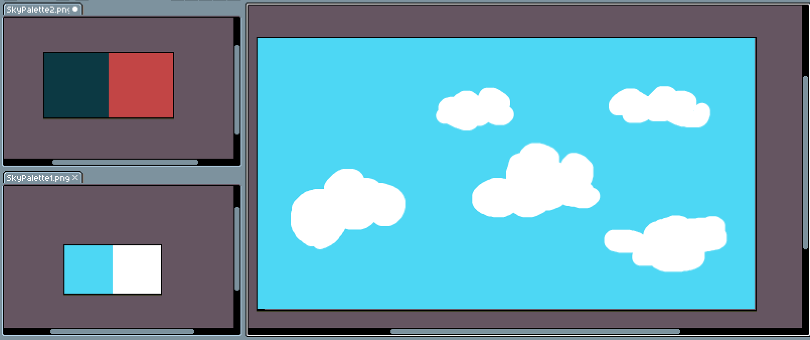
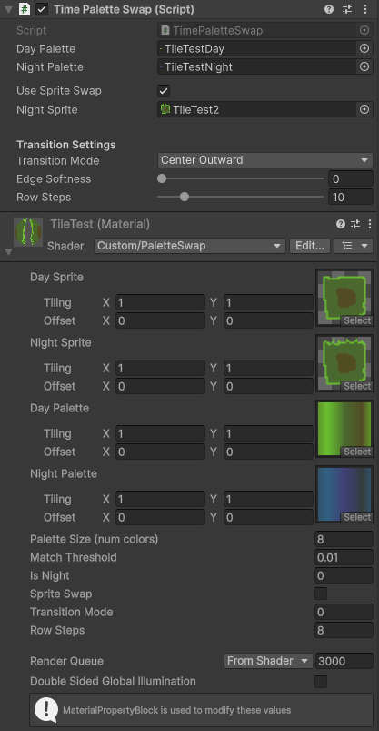
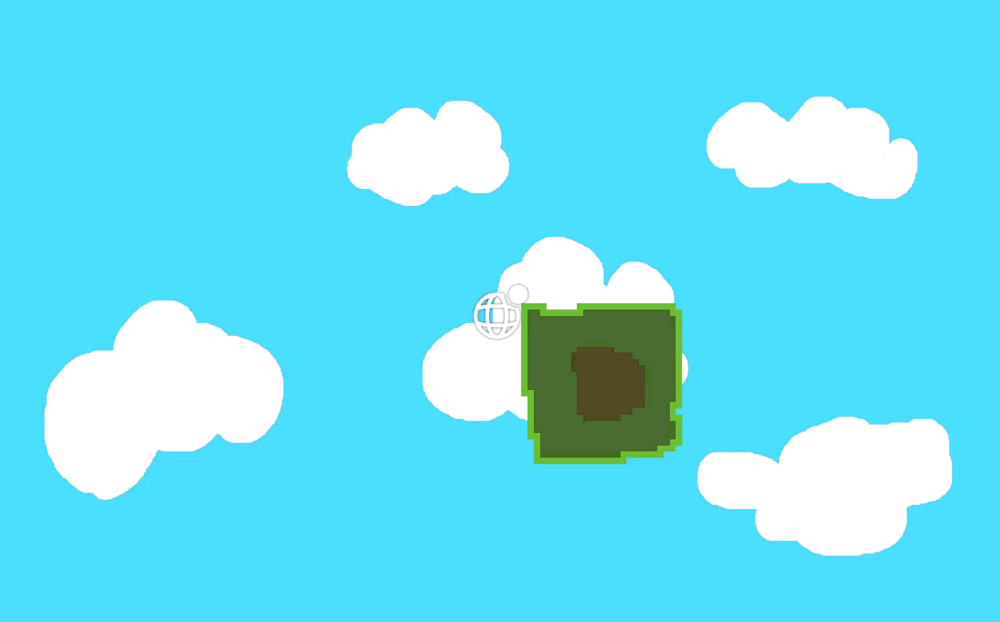

# Palette Swap for Unity 2D

This project implements a palette swapping system for Unity 2D games, allowing dynamic switching between day and night color schemes for sprites.

## Screenshots

## Requirements

- Unity 6.3 or compatible version
- Unity 2D project

## How It Works

This palette swapping system is designed for pixel-style 2D games (not yet compatible with non-pixel art). It works by replacing colors in a sprite's texture with corresponding colors from a palette texture. Each palette is a 1-pixel high texture where the width represents the number of colors (e.g., 8 colors = 8 pixels wide).

Optionally, sprites can also swap to an entirely different night variant texture during the transition, allowing visual changes beyond color (e.g. a character gaining a sword at night) while the palette blend runs simultaneously.

### Key Components

1. **PaletteSwap.shader**: A custom shader that performs the color replacement in real-time, with optional night sprite blending.
2. **PaletteSwapManager.cs**: Manages the day/night state and handles transitions with a configurable duration.
3. **PaletteSwapper.cs**: Applies the palette swap to individual sprites, with an optional sprite swap mode.

### Palette Format

- **Height**: Must be exactly 1 pixel
- **Width**: Can be any size (number of colors), but day and night palettes must have identical widths and color mappings
- Each pixel represents one color in the palette
- **Important**: The day palette must contain the exact colors used in the sprite texture. The night palette should have corresponding alternative colors in the same positions. Day and night palettes must match exactly in size and color positions. Mismatched palettes may produce undefined visual results.

## Setup Instructions

### 1. Import the Assets

Add the following files to your Unity project:
- `PaletteSwap.shader`
- `PaletteSwapManager.cs`
- `PaletteSwapper.cs`

### 2. Create Palette Textures

1. Create two palette textures (PNG format recommended):
   - Day palette: Contains the exact same colors as the sprite you want to palette swap (original/daytime colors)
   - Night palette: Contains the nighttime/alternative colors corresponding to each day color
2. Ensure both palettes have:
   - Height of 1 pixel
   - Identical width (same number of colors)
   - Import settings in Unity:
     - **Texture Type**: Sprite (2D and UI)
     - **Wrap Mode**: Clamp
     - **Filter Mode**: Point (no filter)
     - **Format**: Any
     - **Compression**: None

### 3. Create the Material

1. Create a new Material in Unity
2. Set the Shader to `Custom/PaletteSwap`
3. In the Material properties:
   - **Day Sprite**: Assign the day sprite texture (ensure it has pixel-art friendly import settings: Texture Type = Sprite, Wrap Mode = Clamp, Filter Mode = Point, Compression = None)
   - **Night Sprite**: Assign the night variant sprite texture (only used when Sprite Swap is enabled)
   - **Day Palette**: Assign your day palette texture
   - **Night Palette**: Assign your night palette texture
   - **Palette Size**: Set to the width of your palettes (number of colors)
   - **Match Threshold**: Adjust sensitivity for color matching (default 0.01)
   - **Is Night**: Controlled by the script (0 = day, 1 = night)
   - **Sprite Swap**: Toggle to enable night sprite blending (can also be set via the PaletteSwapper script)

### 4. Set Up the Palette Swap Manager

1. Attach the `PaletteSwapManager` script to any GameObject in your scene (e.g., the player object)
2. Configure settings:
   - **Starting State**: Choose Day or Night
   - **Toggle Key**: Key to switch between day/night (default Tab)
   - **Transition Duration**: Duration in seconds for the palette blend transition (set to 0 for an instant swap)

### 5. Apply to Sprites

1. Select a SpriteRenderer in your scene
2. Attach the `PaletteSwapper` script to the same GameObject as the SpriteRenderer
3. Assign the Material you created to the SpriteRenderer's Material field
4. In the `PaletteSwapper` script:
   - **Day Palette**: Assign the day palette texture (must match the one in the material)
   - **Night Palette**: Assign the night palette texture (must match the one in the material)
   - **Use Sprite Swap**: Check this if the sprite has a night variant texture
   - **Night Sprite**: Assign the night variant texture (only required when Use Sprite Swap is checked)

   **Note**: The palettes assigned to the `PaletteSwapper` script must exactly match those in the material (No clue what happens when they are not matching).

## Usage

- Press the configured toggle key (default Tab) to switch between day and night
- If **Transition Duration** is set to `0`, the palette swaps instantly
- If **Transition Duration** is greater than `0`, each color in the sprite smoothly interpolates between the day and night palette over the specified duration — this is driven per-frame via the shader's `_IsNight` blend weight (`0` = full day, `1` = full night)
- Sprites without a night variant work as normal palette-only swaps — simply leave **Use Sprite Swap** unchecked
- Sprites with **Use Sprite Swap** enabled will cross-fade between the day and night sprite textures in sync with the palette transition
- Multiple sprites can share the same palette setup by using matching materials and PaletteSwapper configurations

## Technical Details

The shader performs color matching by comparing each pixel of the sprite against the day palette colors. When a match is found (within the threshold), it replaces the color with the corresponding color from the night palette, interpolated based on the `_IsNight` value (a float from 0 to 1). This allows smooth per-color blending between palettes during transitions.

When sprite swap is enabled via the `_SPRITE_SWAP` shader keyword, the fragment shader first cross-fades between the day and night sprite textures using `_IsNight`, then runs the palette lookup on the blended result. When disabled, the keyword is compiled out entirely with no performance cost.

The `PaletteSwapManager` broadcasts two events: `OnTimeSwitched` (fires once when the transition completes) and `OnTransitionProgress` (fires every frame during a transition with the current blend value). The `PaletteSwapper` subscribes to both — `OnTransitionProgress` drives the smooth blend each frame, while `OnTimeSwitched` snaps the value to a clean `0` or `1` at the end.